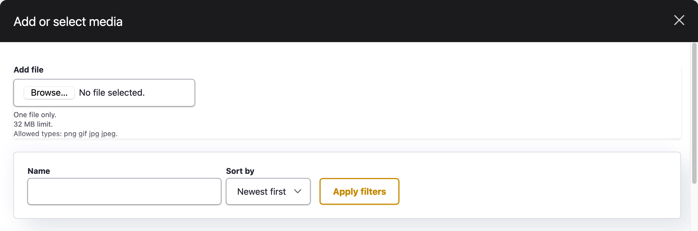

# Table of contents
Test

1. [Drupal Glossary](https://gitlab.com/openresources/resourcehub_distribution/-/wikis/Guide-for-content-editors-&-site-admins#drupal-glossary)
1. [An overview](#an-overview)
1. [The basics (logging in)](#the-basics)
1. [Managing your content](#managing-your-content)
1. [Managing your files and media](#managing-your-files-media)
1. [Managing taxonomy](#managing-taxonomy)
1. [Managing menus](#managing-menus)
1. [Managing users](#managing-users-on-your-site)
1. [Configuring the site](#configuring-site)
1. [Customising the theme](#theme-customisation-settings)

# Drupal Glossary
| Term | Definition |
| ------ | ------ |
| Drupal | The content management system on which the Guidance Repository is based. The terms below are Drupal-specific terminology.|
| Entity | A container to store types of data e.g. user, content type, block.  |
| Content type | A type of entity for creating pages e.g.  page, resource, landing page etc. It defines default settings, such as the fields, metatags, and URL path pattern. |
| Node | Each item of content is called a node, and each node is one instance of a content type. |
| Taxonomy | Taxonomy is a type of entity that  allows you to connect, relate and classify your website’s content. A taxonomy "vocabulary" e.g Topic  contains “terms” e.g. Health, Wellbeing, Digital literacy. You can add taxonomy terms to an individual resource. |
| Field | Fields contain data: text, number, date, media etc. On a node edit form, they appear in a variety of widgets such as text boxes, select lists, autocomplete search, etc. |
| Users and Roles | Anyone who visits your site is a user and falls into one of 2 types of role: Anonymous  or Authenticated. Custom roles define the permissions that dictate what that role can and can’t do. For example, the content editor has the permission to create and delete content on the site, whereas an anonymous user does not. |
| Theme | The theme is the look of your website: colours, fonts, page layouts etc. In other words, it is the implementation of a design on a web site. |

# An overview

# The basics
## How do I log in? 

1. Go to [www.yoursite.com]/user
1. Enter username and password
1. If you have forgotten your password click “Request new password” and enter your username or email address 

## How do I log out? 

When you are on an administration page you should see your username in the top right. If you hover over this you will access the User menu including the *Log out* button.

## What can I do? 
Each user has a set of permissions based on the role they have been assigned.
We have set up two custom roles: Site admin, Content editors

These instructions cover all areas, but you may not have access to all this functionality. 

## Navigating the administration

Once you have logged in to the site you will be able to see the Admin Menu at the top of the browser window. 

 
| Menu item | Description |
| ------ | ------ |
| Content | Managing content of your site. |
| Resource Hub | Configuring your site information and customisation. |
| Structure | Manage menus and taxonomies. |
| People | Managing existing users on your site and to create new users. |
| Configuration | Configuration of various site settings, usually only for web developers. |

# Managing your content 
## Editing existing content

There are two options
1. Edit from the page
1. Find the page via the content overview

### Edit from the page

1. Navigate to the page that you wish to edit.
1. You will see 4 tabs under the heading ‘View’, ‘Edit’, ‘Delete’ and ‘Revisions’.
1. Select the ‘Edit’ tab. If you do not see this tab it is because either you are not logged in or you do not have permission to edit this page.
1. Make the changes you need to make.
1. You can check the changes you have made using the 'Preview' button.
1. Once you are happy with the change, click 'Save'.
1. Check that the page is displaying as you want it to. If you need to make any further changes, edit the page again.

### Find the page by searching 

1. Go to the “Content” overview via the Admin Menu.
1. Use the search or filter options to find the page - click the edit button beside this item.
1. Follow steps 4-7 above.

## Creating new content

1. Go to Content >> Add Content >> (select the type of content you would like to create).
1. You will then see the new content form with a number of  fields that you can fill in to create your new content. 
1. Any field marked with an asterisk (*) is mandatory, you must fill this in in order to save the Content.
1. Once you have finished editing the page, click 'Save'.

## Different types of field you will encounter
There are various types of field that we have set up for you, outlined below are some of the more common ones.

| Field type | Description |
| ------ | ------ |
| Title | This is the page heading that appears above the content.This is also used for your Meta-title and in the URL. |
| Media | An image, file or multimedia item. |
| Reference fields | Creates an internal link to another page in your site. They work by referencing the title of the content you wish to link to. Usually displayed as an autocomplete search widget. |
| Rich-text Fields | Contains a text editor (CKEditor) with a number of formatting options (see below). |
| Paragraphs / Content sections | The paragraph module allows you create predefined “bundles” of fields which enables a content editor to create a more flexible page layout with consistent reusable components. Some examples are a video embed, image, audio embed with transcript. |

### Formatting options

The CKEditor toolbar buttons are illustrated with meaningful icons. If you are not sure what functions they perform, hover the mouse cursor over the buttons to see a tooltip with the name of the function.

### Adding media
To add media to a node, click add media and select either
1. Add file
2. Search existing files
3. Select an item from the list and click 'insert selected'

#### Adding images
1. Click ‘Browse’ and select an item from your device to upload
1. Name the item
1. Add alternative text - a brief description of what the image is showing
1. Crop the item if needed
1. Once you are finished, click save
1. The image will appear in uploaded media and be automatically selected. 
1. To add the image to the node, click ‘insert selected’. 

#### Cropping images
If an image is too large or you want it to focus on a particular area, you can crop the image when uploading.
1. Select the ‘Crop image’ dropdown.
1. Select ‘main image’ (how it appears on a page or when downloaded) or ‘thumbnail crop’ (how it appears in  search results and lists)
1. The image will appear with a blue box around the visible area
1. Click on the sides and the corners to resize this - anything within the blue box will be visible, while cropped content will be greyed out. 

#### Adding audio and video
Adding audio and video content requires the content to be uploaded and available through a provider such as SoundCloud, Spotify, Vimeo or YouTube.

1. Select 'add audio' or 'add video'
1. Add a title, caption and transcript if available
1. Select 'add media'
1. Paste the URL of the media item and click 'add'
1. Rename the item if you wish and then 'Save'
1. The item will be automatically selected in the list below, click 'insert selected'

### Creating a link to internal links
On the text editor, select the link icon. A popup will appear:

#### Internal links and files

In the URL field you can type the title of the page or file you want to link to. Once you start typing,  the widget will offer suggestions from which you can choose. 

#### External links 
To add an external link (ie a link to an external website), simply enter the URL in the URL field and then click Save.

#### Accessibility checker
Once you have finished adding text to the text field, you can check for some common accessibility issues by clicking the a11y checker button. Find out more about how to write accessible content here. /// todo 

## Page settings

When you are editing content, on the right of the page you will see a variety of configuration options, depending on your permissions. You will usually be able to see the following:

| Setting type | Description |
| ------ | ------ |
| Authoring information | Shows who created the node and when. |
| Menu Settings | Edit this to put the node in the menu (if available). Toggle “Provide a menu link”. The ‘Parent link’ defines the item above the current page in the menu hierarchy. |
| URL alias  | This is the human readable URL of the page, by default generated by the page title. If you want to customise this you can toggle 'Generate automatic URL alias' and write your own. |
| XML sitemap | todo |
| Metatags | todo |

## Creating a resource
## Creating a landing page
## Creating a page

# Managing your files & media
This lives in Content >> Files or Content >> Media.
All your files, images and videos can be found in one place under Content >> Media in the Admin Menu.
You can edit and delete the files from here (if you have the appropriate permissions).
Drupal will warn you if the file you wish to delete is in use, so read the messages carefully! If it is in use it is best to either:
- remove the image from the content and then remove the image
- remove the content with the image in it and then remove the image itself

# Managing taxonomy
All the vocabularies used on the site are at Structure >> Taxonomy. 
This page will show a table listing all your vocabularies. The name of vocabulary is on the left with the possible operations on the right.
- To see a list of the terms within a vocabulary,  click on “List terms”. 
- To add a new term , click “Add term”.
- To edit an existing term (ie to change its name), click on “List terms” and then “Edit”.
- To see all content tagged with a term, click on “List terms” and then click on the term name. 

## Resource Hub taxonomies 

The resource hub comes with four predefined taxonomy vocabularies, which are used to classify resources. The vocabularies are not designed to be editable, but the terms within them are. 
We expect the terms to be unique to your organisation, and how you categorise your content. However there are some examples below:

| Vocabulary name | Purpose | Example terms |
| ----- | ----- | ----- |
| Audience | Who is the resource aimed at? | Teachers, Social workers, etc |
| Topics | What (broadly) is the resource about? | Health, Wellbeing, etc |
| Resource type | What kind of resource is this? | Guidance, Legal advice, etc |
| Format | What format is this resource ? | Video, Audio, etc |

# Managing menus

When creating a piece of content you have the option to place the content in the menu structure or you can access the menu structure through  Structure >> Menus

| Setting | Description |
| ------ | ------ |
| Menu Link Title | Title which appears in the Menu e.g. “About” |
| Parent item  | The parent item to which the new item belongs.  |
| Weight | Defines the order in which items are displayed at the same level in the hierarchy. An item with a weight of 1 will display above or before one with a weight of 10. |

## How can I reorder menu items?
If you need to re-organise the menu structure, or the position of a node within the menu structure you can do so from Structure >> Menu.
You will see a list of all the available menus. 

- To the right of the menu there is an option to ‘Edit Menu’. Click this.
- You will see the whole menu hierarchy laid out. Items indented to the right are children of the item above and left of it. 

You can reorder menu items using the cross to the left of the link title, however, we advise that you do this with care.

If you find the drag and drop handles difficult to use you can click the “show row weights” link and this will allow you to enter numbers determining the order. Lower numbers / weights will come before higher numbers / weights within each level.

# Managing users on your site

## How can I edit my own Account?
1. Click on your Username in the Admin menu.
1. Click ‘Edit profile’.
1. Here you can update your password or change your username.

## How do I create a user?
You may wish to give someone some responsibility for managing  the content of your site. We will have allocated some roles within your site, and one of these is ‘Content editor’. This role has the permission to create, edit and delete content on the site, along with other associated permissions. 

1. Go to ‘People’ - this will give you a list of all the people registered on the site, and their associated roles.
1. Click Add User.
1. Fill out the Name, Email, Password fields.
1. Set ‘Status’ to active.
1. Assign the desired role to the user.
1. Check the ‘Notify user of new account’ box to send the user an email about their new account on the site.
1. The new user is sent a one-time log-in link and asked to reset their password.

## How do I block / cancel a user’s account?

1. On the ‘People’ page, search for the user by using the filter options.
1. Check the box next the user you wish to delete.
1. Above the table of users, click on the Action dropdown and select one of the following options:
- Block the selected user(s)
- Cancel the selected user account(s)

## Resource Hub Roles 

The resource hub comes with two custom roles predefined. These are broadly: 
| Role | Permission | Notes |
| ----- | ----- | ----- |
| Site admin | Can manage users | Can manage site configuration	|
| Give to trusted users only | Content editor | Can create, edit & delete content, taxonomy terms, and menu items |

# Site configuration

A site administrator has access to the Resource Hub settings page, from the Admin menu. 
## Site name
The site name is required
## Legal copy
The legal copy is an optional block of text which will appear in the footer of the site, on each page. We imagined you might want to put your organisations legal details, or similar. 
## Back to site link
The Back to site link was designed to point to another web property, such as the organisation’s main website. If filled in, it will appear in the header of the site. 

# Theme customisation settings
## Color scheme
The default colour set is the Resource Hub default. To add an accent colour to the site you can either pick a colour from the colour wheel, or enter a custom colour in HEX format. 
## Logo
To change the logo on the site, toggle the “Use the logo supplied by the theme” and Upload an image file or enter the path to the image on the server. 
## Favicon
A favicon appears in your browser tab, and lets people more easily spot your website if they have many tabs open. 
Upload a custom favicon here.