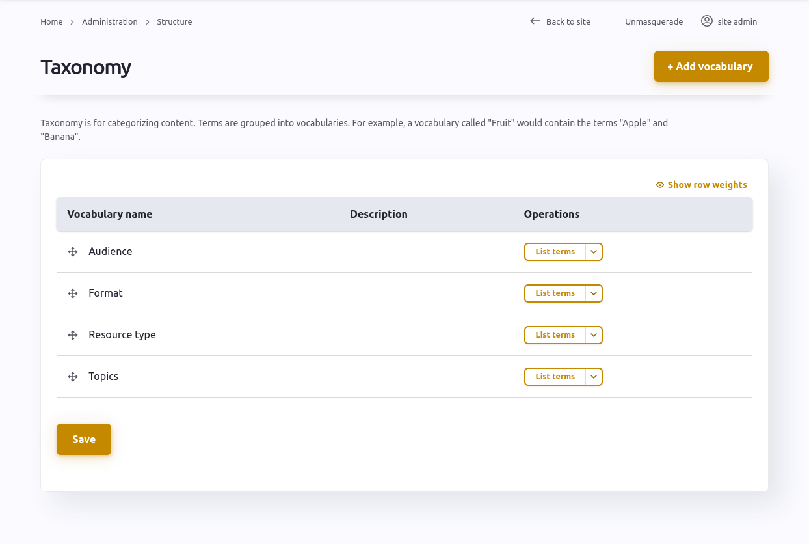

Assumption: the site has been installed without the default content module. You have an account on the site, with the role of 'site administrator'. 

## Step one: name your site and set up the branding and site wide elements.
[Configuring the site](https://gitlab.com/openresources/resourcehub_distribution/-/wikis/Guide-for-content-editors-&-site-admins#site-configuration)

## Step two: define your taxonomies.

You will need to set up the taxonomy terms before you start creating the resources, so that you are able to tag the resources consistently. 

We recommend that you consider the terms you may need carefully - particularly the Topics. 

Think about the broad topics that your service users are looking for content from you for. What terminology is familiar to them? 

[Manage taxonomies](https://gitlab.com/openresources/resourcehub_distribution/-/wikis/Guide-for-content-editors-&-site-admins#managing-taxonomy)

## Step three: create your homepage.
## Step three: create resources.
## Step four: create landing pages.